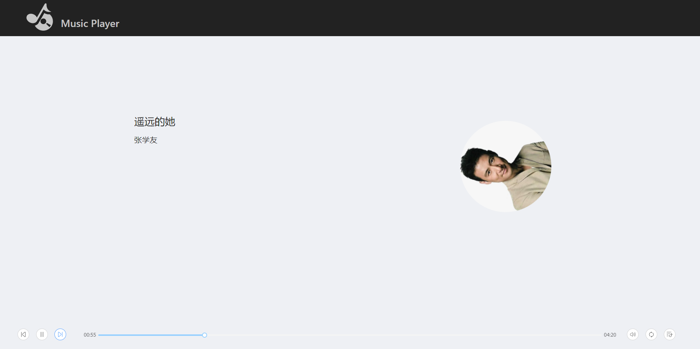

# Music Player

> Music Player 是一个基于 React 开发的 Web 音乐播放器。

> 项目中使用了 Redux 来管理全局的 state。UI 使用的是 antd-design。

> 音乐播放使用的是 react-player。 **这个插件是纯css+js实现的，不需要依赖jQuery**

在线预览: https://shurlormes.github.io/MusicPlayer/

### 核心依赖版本

* react@16.3.1
* webpack@4.4.1
* antd@3.4.0
* react-player@1.3.1

详细依赖关系见 package.json

### 使用说明

	# 下载项目
	git clone git@github.com:Shurlormes/MusicPlayer.git
	
	# 安装依赖
	npm install
	
	# 启动开发服务
	npm run server

	# 编译
	npm run build
	
